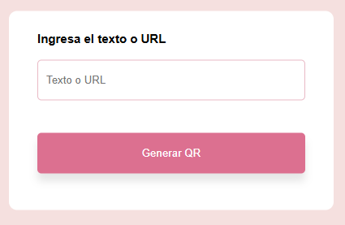

# Generador de QR ⋆˚✿˖°

Un generador de códigos QR simple y elegante para crear QR a partir de texto o URLs.

## ✿ Características

- Interfaz limpia e intuitiva
- Generación instantánea de códigos QR
- Validación de entrada con animación
- Diseño responsive

## ⋆ Uso

1. Abre el archivo `index.html` en tu navegador
2. Ingresa el texto o URL 
3. Haz clic en "Generar QR"
4. ¡Listo! Tu código QR aparecerá automáticamente

## ˚ Tecnologías

- HTML5
- CSS3
- JavaScript
- API de QR Server

## ✿ Capturas de Pantalla

### Interfaz Principal

### Ejemplo de QR Generado

---

⋆˚✿˖° Proyecto simple y funcional para generar códigos QR
